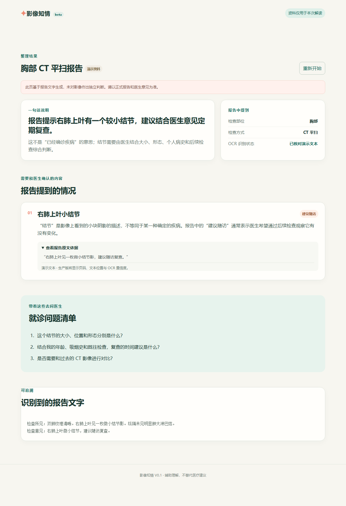

# 影像知情（imaging-informed）

帮助患者**看懂**自己的检查报告：拍照/上传报告 → OCR 提取原文 → 大模型生成「有原文依据」的通俗解读。

> ⚠️ **免责声明**：本项目是健康信息辅助工具，**不提供医学诊断、治疗建议或用药指导**。
> 所有内容仅供参考，任何健康问题请咨询执业医师。项目作者不对依据本工具输出做出的任何决定负责。



## 功能

- **报告 OCR**：支持手机拍照（JPG/PNG/WEBP/BMP）、文本型 PDF、TXT；返回原文、逐行置信度和版面坐标
- **LLM 结构化解读**：一句话总结、异常项清单（三级标注）、逐句解释、建议问医生的问题
- **防幻觉设计**：模型引用的每一句「原文依据」都必须能在 OCR 原文中逐字命中，命中不了的直接丢弃——解读永远可回溯到原文
- **微信小程序患者端**：上传 → 解读 → 展示的完整链路，含隐私授权弹窗、上传/解读过程状态反馈
- **Web 静态演示**（`web/`）：无构建依赖的原型页，可直接体验流程

## 架构

```
报告照片 / PDF / TXT
        │
        ▼
┌─────────────────┐     ┌──────────────────────┐
│  FastAPI 后端    │     │  PaddleOCR (PP-OCRv5) │
│  /api/reports/ocr ───▶ │  mobile 模型，CPU 推理  │
└────────┬────────┘     └──────────────────────┘
         │ 原文 + 置信度 + 版面坐标
         ▼
┌──────────────────────┐
│ /api/reports/interpret│  LLM（任意 OpenAI 兼容接口，
│  严格 JSON + 原文校验   │  默认 DeepSeek）
└────────┬─────────────┘
         │ 摘要 / 异常项 / 逐句解释 / 就诊问题（全部附原文引用）
         ▼
   微信小程序患者端
```

## 目录结构

```
├── backend/        FastAPI 后端：OCR + LLM 解读
├── miniprogram/    微信小程序患者端
├── web/            无构建依赖的静态演示页
├── schemas/        解读结果的 JSON Schema 约定
├── deploy/         systemd 单元与环境变量模板
└── docs/           部署文档
```

## 快速开始

### 后端（本地开发）

```bash
python -m venv .venv
source .venv/bin/activate          # Windows: .venv\Scripts\activate
pip install -r backend/requirements.txt
uvicorn backend.main:app --reload --port 8000
```

- 接口文档：`http://127.0.0.1:8000/docs`
- 试一下：`curl -F "file=@backend/fixtures/sample-report.txt" http://127.0.0.1:8000/api/reports/ocr`
- 图片 OCR 首次调用会下载 PP-OCRv5 mobile 模型（数百 MB），之后常驻内存

### LLM 解读配置

`/api/reports/interpret` 通过环境变量接入**任意 OpenAI 兼容**的聊天接口：

| 变量 | 说明 | 默认值 |
|---|---|---|
| `LLM_API_KEY` | API 密钥（必填，未配置时接口返回 503，前端自动回退为只展示原文） | 无 |
| `LLM_BASE_URL` | 接口地址 | `https://api.deepseek.com` |
| `LLM_MODEL` | 模型名 | `deepseek-chat` |

> ⚠️ **隐私提示**：开启解读功能意味着报告文字会发送给第三方大模型服务。
> 对外提供服务前，请在隐私政策中如实声明，并评估所在地医疗数据合规要求。

### Web 演示

```bash
cd web && python -m http.server 5173
# 打开 http://localhost:5173
```

### 微信小程序

1. 微信开发者工具导入 `miniprogram/` 目录（无 AppID 可选择测试号）
2. 修改 `miniprogram/config.js` 中的 `apiBaseUrl` 为你的后端地址
3. 真机预览前，在「详情 → 本地设置」勾选「不校验合法域名」（仅开发调试）

正式发布小程序还需：ICP 备案的 HTTPS 域名、隐私保护指引配置，
且医疗健康类目要求**企业主体**——详见[合规说明](#合规与边界)。

## 部署到服务器

完整的生产部署步骤（Alibaba Cloud Linux 3 实测，含 PaddleOCR 在小内存机器上的
OneDNN 兼容性坑、swap 配置、systemd 常驻）见 **[docs/DEPLOY.md](docs/DEPLOY.md)**。

## 安全设计

- **证据强制**：所有异常项和解释必须附带报告原文引用，服务端逐字校验，捏造即丢弃
- **不越界**：prompt 层面禁止输出诊断结论、治疗方案、用药建议和紧急程度判定
- **可降级**：OCR 低置信度标记 `needs_review`；LLM 不可用时前端回退到纯原文展示，不伪造内容
- **不留存**：上传文件在临时目录处理完即删除，不落盘、不入库

## 合规与边界

本项目处于原型阶段，距离生产可用还有明确的待办：

- [ ] 用户认证与访问控制
- [ ] 传输/存储加密、审计日志、数据删除机制
- [ ] 小程序隐私保护指引（必须声明报告文字发送至第三方 LLM）
- [ ] ICP 备案 + HTTPS 域名
- [ ] 小程序医疗健康类目需企业主体
- [ ] 所在地医疗软件与个人信息保护合规评估

**不要**将本系统直接用于真实患者的临床决策场景。

## 路线图

- [x] 报告拍照/PDF → OCR → 原文 + 坐标
- [x] LLM 结构化解读 + 患者端展示
- [ ] OHIF 本地拖拽查看 DICOM（纯前端，数据不出本机）
- [ ] DICOM 上传 → Orthanc / DICOMweb → OHIF
- [ ] 结构化异常项与影像序列联动
- [ ] MONAI Label / TotalSegmentator（需 GPU 与更严格的合规评估，远期）

影像查看部分的完整规划（三档方案：资源需求、隐私风险、推进顺序）见 **[docs/OHIF-PLAN.md](docs/OHIF-PLAN.md)**。

## 贡献

欢迎 Issue 和 PR。涉及医疗表述、隐私处理的改动请在 PR 中说明依据。

## 许可证

[MIT](LICENSE)
